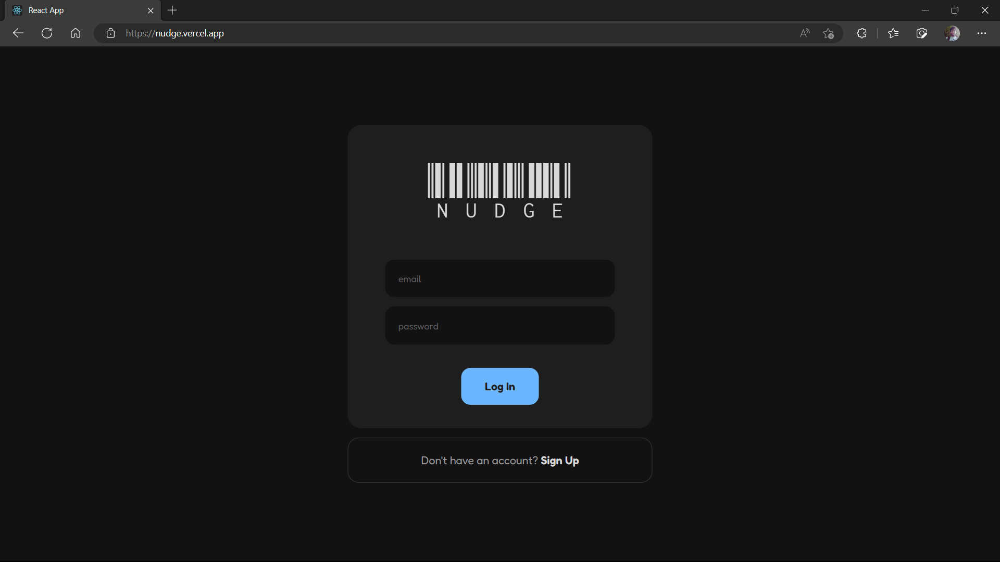
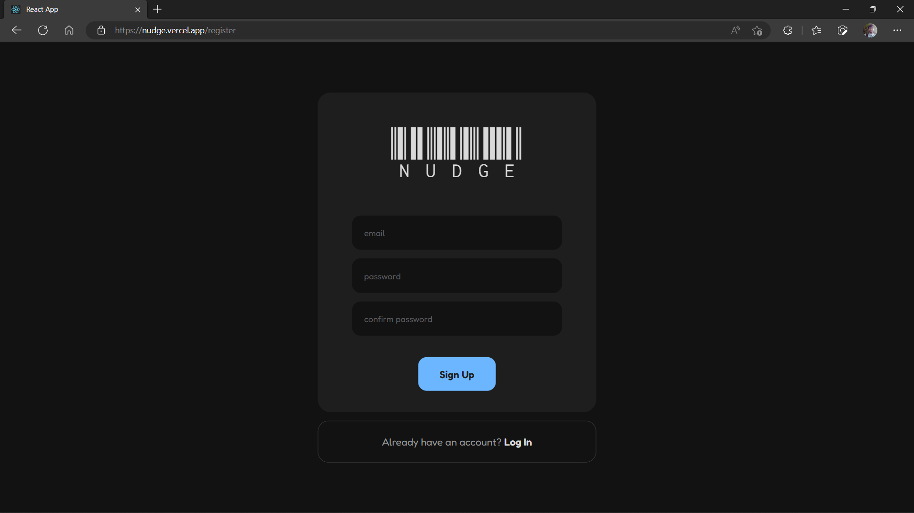
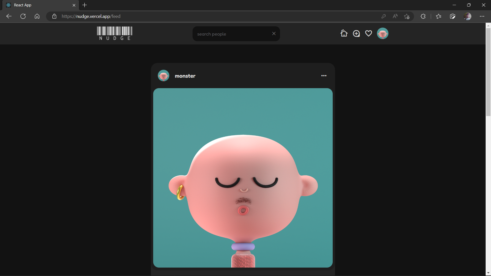
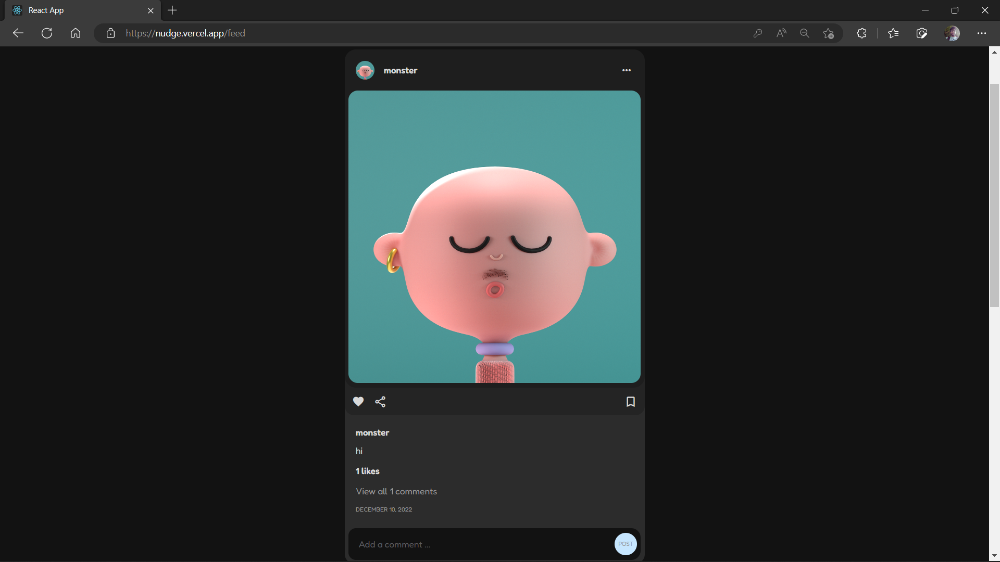
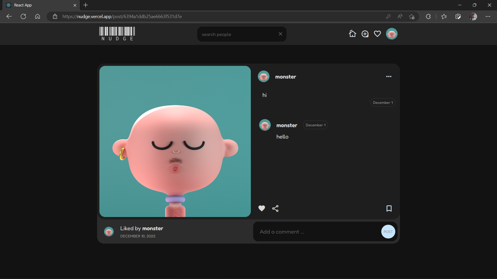
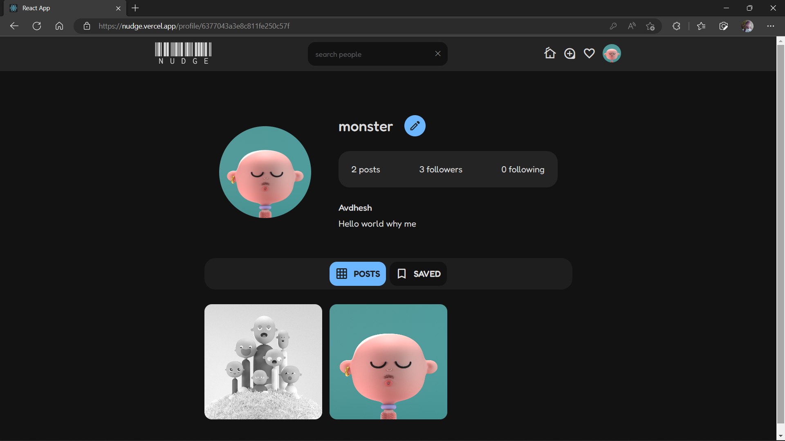
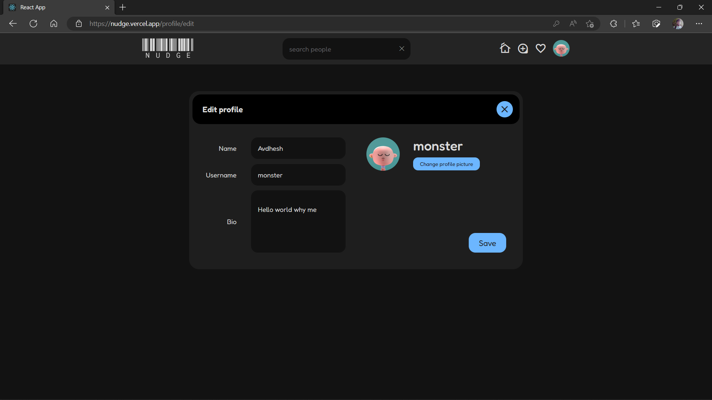
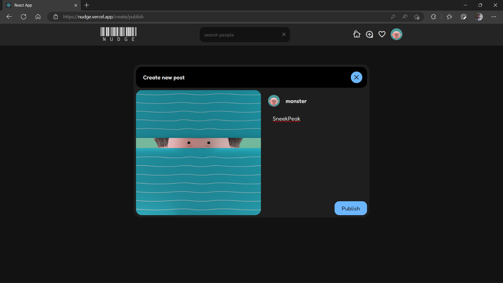

# nudge


### About

Nudge is an image sharing social networking service that allows users to upload media and share it with their peers.

### Development

-   Install Dependencies.

```sh
npm install
```

-   Run Development Server.

```sh
npm start
```

-   Run Sass Configuration.

```sh
npm run sass
```

---

### Backend

-   Refer to [nudge-backend](https://github.com/avi-spc/nudge-backend) repo and follow instructions to setup a backend server.

---

### Technologies Used

##### Back End

-   [Node](https://nodejs.org)
-   [Express](http://expressjs.com)
-   [MongoDB](http://mongodb.com)
-   [Mongoose](http://mongoosejs.com)

##### Front End

-   [React](https://reactjs.org)
-   [Sass](https://sass-lang.com/)

##### State Management

-   [Redux](https://redux.js.org)

### Screenshots

#### SignIn / SignUp




#### feed




#### Individual Post



#### Profile




#### Create Post



